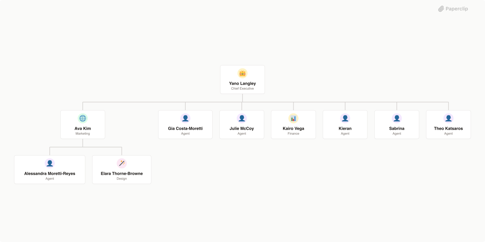

# CBI - Conroy Browne International

> The AI Company OS for Conroy Browne International. Manages lead generation, content creation, client engagement, and reactivation. Starting with the CB Wellness reactivation pipeline, scaling to full autonomous business operations across all CBI ventures.



## What's Inside

> This is an [Agent Company](https://agentcompanies.io) package from [Paperclip](https://paperclip.ing)

| Content | Count |
|---------|-------|
| Agents | 10 |
| Skills | 11 |

### Agents

| Agent | Role | Reports To |
|-------|------|------------|
| Alessandra Moretti-Reyes | general | ava-kim |
| Ava Kim | CMO | yano-langley |
| Elara Thorne-Browne | designer | ava-kim |
| Gia Costa-Moretti | general | yano-langley |
| Julie McCoy | general | yano-langley |
| Kairo Vega | CFO | yano-langley |
| Kieran | general | yano-langley |
| Sabrina | general | yano-langley |
| Theo Katsaros | general | yano-langley |
| Yano Langley | CEO | — |

### Skills

| Skill | Description | Source |
|-------|-------------|--------|
| alessandra-moretti-reyes | — | catalog |
| ava-kim | — | catalog |
| elara-thorne-browne | — | catalog |
| gia-costa-moretti | — | catalog |
| kairo-vega | — | catalog |
| theo-katsaros | — | catalog |
| yano-langley | — | catalog |
| paperclip-create-agent | > | [github](https://github.com/paperclipai/paperclip/tree/master/skills/paperclip-create-agent) |
| paperclip-create-plugin | > | [github](https://github.com/paperclipai/paperclip/tree/master/skills/paperclip-create-plugin) |
| paperclip | > | [github](https://github.com/paperclipai/paperclip/tree/master/skills/paperclip) |
| para-memory-files | > | [github](https://github.com/paperclipai/paperclip/tree/master/skills/para-memory-files) |

## Getting Started

```bash
pnpm paperclipai company import this-github-url-or-folder
```

See [Paperclip](https://paperclip.ing) for more information.

---
Exported from [Paperclip](https://paperclip.ing) on 2026-04-01
